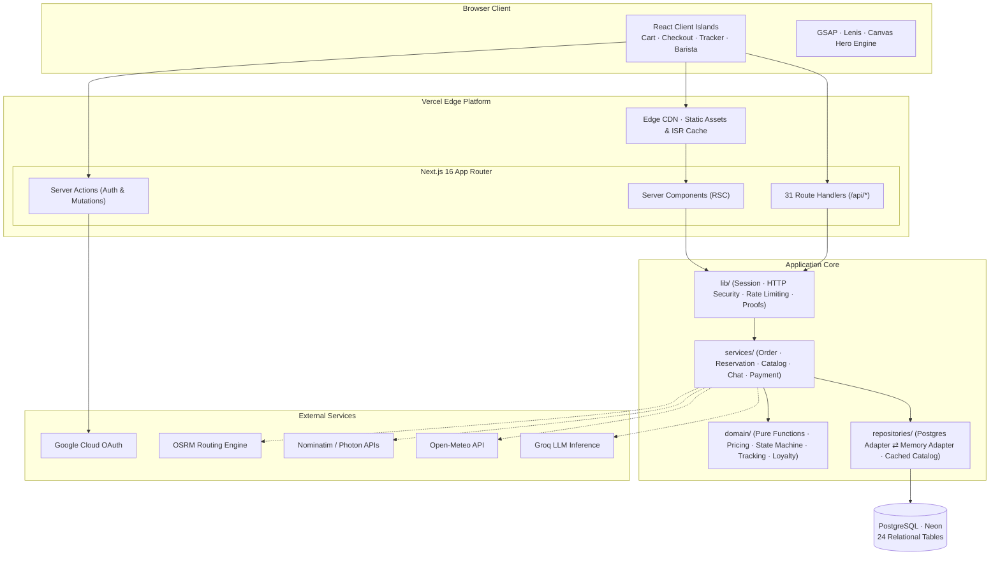
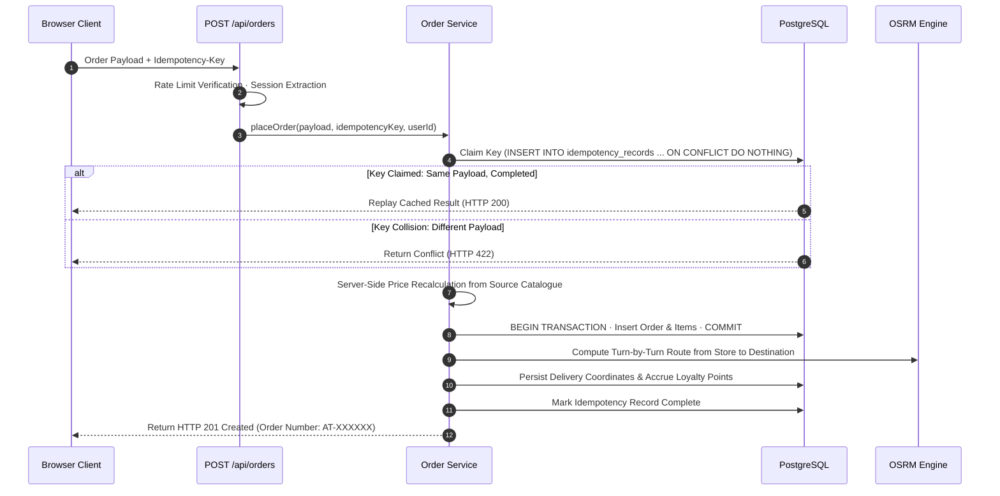
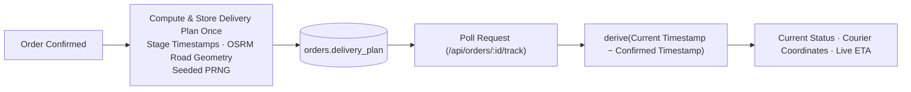
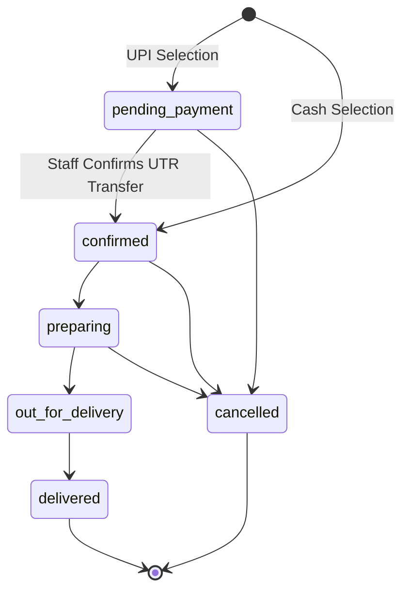
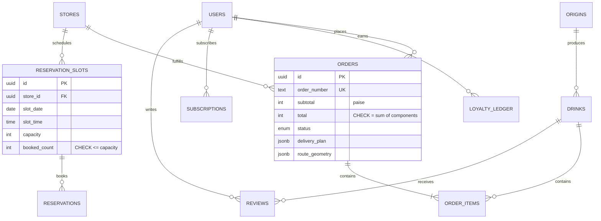

<div align="center">


<br />
<br />


# AURA TOAST

### Atmospheric Craft · Pure Origin

**A production-grade specialty-coffee platform** — order, track your cup live on a map, reserve a table, earn loyalty,<br />
subscribe to whole beans and chat with an AI barista. Twelve cafés, six cities, five named farms.

<br />

[](https://aura-roast-seven.vercel.app)

<br />


<br />

[Features](#features) · [Architecture](#system-architecture) · [System Design](#system-design-deep-dive) · [Database](#database-design) · [API](#api-reference) · [Security](#security--privacy) · [Performance](#performance) · [Getting Started](#getting-started) · [Deployment](#deployment)

</div>

<br />

## Overview

AURA TOAST is a full-stack Next.js application built to production standards. Beyond a cinematic, scroll-driven interface, the architecture is engineered around core correctness and data integrity guarantees required by enterprise commerce systems:

<table>
<tr>
<td width="50%" valign="top">

**Server-Owned Pricing**<br />
The client renders an instantaneous price preview, but the server re-evaluates and prices every line item against the authoritative catalogue during checkout. Client-side price tampering is rejected.

**Idempotent Order Pipeline**<br />
Network interruptions and repeated submission attempts cannot produce duplicate charges or orders. A cryptographic idempotency key guarantees deterministic, single-execution order resolution.

**Atomic Capacity Management**<br />
Reservation slots are decremented atomically using single-statement SQL updates with database-level constraints, preventing overbooking under high concurrent load.

</td>
<td width="50%" valign="top">

**Stateless Telemetry & Tracking**<br />
Delivery routing and timeline milestones are determined once at order confirmation. Real-time courier coordinates and ETAs are derived purely as a function of elapsed time along the route geometry, eliminating background daemon dependencies.

**Privacy-First Access Control**<br />
Order resources are addressed via cryptographically unguessable identifiers. Customer contact details are masked across public endpoints, and back-office tools require verified administrator credentials.

**Optimized 60 FPS Render Pipeline**<br />
A 144-frame scroll-scrubbed canvas hero is tuned with off-thread bitmap decoding and bounded memory windows, reducing main-thread overhead by 47% and memory footprint by 370 MB.

</td>
</tr>
</table>

<br />

## Features

| Feature | Capabilities & Architecture |
|---|---|
| **Menu & Brew Builder** | 16 drinks from 5 single-origin estates · dynamic pricing, caffeine calculation, and tasting-note preview · server-confirmed quotation · stateful filter persistence |
| **Cart & Checkout** | Session-backed persistent cart · proximity-based café resolution · address geocoding · cash or instant UPI flows · coupon engine · customizable tips · automated GST calculation |
| **Real-Time Order Tracking** | Road-network routing via OSRM · interpolated courier coordinates rendered on interactive Leaflet maps · dynamic ETA derivation · windowed cancellation rules |
| **UPI Payment Infrastructure** | Dynamic payment links and QR generation · automated UTR reference ingestion · administrative verification interface · zero cardholder data footprint |
| **Table & Event Reservations** | 30-minute booking intervals across 12 café locations · automated scheduling for tasting sessions and brewing workshops · atomic concurrency enforcement |
| **Loyalty & Rewards** | Four-tier progression (Green to Roastmaster) derived dynamically from lifetime point accumulation · append-only audit ledger |
| **Bean Subscriptions** | Recurring deliveries configured across weekly, fortnightly, or monthly frequencies · lifecycle controls (skip, pause, resume, cancel) |
| **AI Barista** | LLM integration powered by Groq (Llama 3.3 70B) with tool calling capabilities (catalogue search, cart insertion, order lookup) · deterministic fallback provider |
| **Authentication Engine** | Auth.js v5 (Google OIDC with PKCE) · encrypted stateless JWT sessions · centralized profile, loyalty, and order association |
| **Administrative Back Office** | Staff dashboard · real-time sales reporting and top-item velocity · multi-criteria order filtering · single-click payment verification |
| **Origins & Location Hub** | Coordinated horizontal scroll and map synchronization · real-time operational status computed in Indian Standard Time (IST) · step-by-step brew guides with interactive timers |

<br />

## Tech Stack

| Layer | Technology | Architectural Rationale |
|---|---|---|
| **Framework** | Next.js 16 (App Router, Turbopack) | Hybrid rendering (Static, ISR, Dynamic), unified route handlers, and server actions |
| **UI Engine** | React 19 · TypeScript (Strict) | React Server Components (RSC) by default; localized client boundaries for interactive components |
| **Styling** | Vanilla CSS Design Tokens · Fluid Type Scaling | Zero runtime overhead; centralized theme variables and typography formulas |
| **Animation & Motion** | GSAP · ScrollTrigger · Lenis · View Transitions API | Hardware-accelerated scroll synchronization, smooth physics interpolation, seamless view transitions |
| **Persistence** | PostgreSQL (Neon) · Drizzle ORM | Serverless HTTP pooling driver, type-safe queries, reproducible SQL schema migrations |
| **Identity** | Auth.js v5 (Google OIDC) | Zero-password architecture, PKCE flow, signed and encrypted JWT sessions |
| **Validation** | Zod 4 | Strict runtime parsing and verification for environment configurations and API payloads |
| **Geospatial & Routing** | Leaflet · OSRM · Nominatim · Photon | Open-source geographic computation, turn-by-turn routing, and forward/reverse geocoding |
| **Language Model** | Groq (Llama 3.3 70B Versatile) | Low-latency inference for tool execution with graceful in-process fallbacks |
| **Infrastructure** | Vercel Serverless Edge Platform | Global Edge CDN caching, on-demand ISR revalidation, serverless compute execution |

<br />

## System Architecture



### Layered Separation of Concerns

| Directory | Layer Responsibility | Contract |
|---|---|---|
| `app/` | UI Presentation and 31 REST API route handlers | Validate input, resolve authentication context, invoke corresponding service, serialize response. |
| `services/` | Business workflows (order creation, reservation lifecycle, payment verification) | Coordinates data access, domain calculations, and external integrations. |
| `domain/` | Pure business rules (pricing calculations, state machine assertions, loyalty rules) | Completely side-effect free. Deterministic logic executed uniformly on server and client. |
| `repositories/` | Data access and persistence abstractions | Provides unified interface over Neon PostgreSQL and local memory adapters. |

### Rendering Strategy Matrix

| Route Pattern | Strategy | Operational Objective |
|---|---|---|
| `/`, `/menu`, `/about`, `/pairings`, `/origins` | Static + ISR (5-minute window) | Edge cache speed with autonomous revalidation upon catalogue updates. |
| `/menu/[drinkId]`, `/guides/[slug]` | SSG + On-Demand `revalidatePath` | Static delivery updated instantly when reviews or guide content are published. |
| `/account`, `/admin`, `/track/[orderNumber]` | Dynamic Server Rendering | Real-time authenticated state and live order tracking without edge caching. |
| `/api/*` | Serverless Function (Node.js runtime) | Low-latency API endpoints executing database transactions and external APIs. |

<br />

## System Design Deep Dive

### 1. Order Creation Sequence



### 2. Atomic Seat Booking Guarantee

Overbooking is prevented at the database layer using single-statement atomic updates without intermediate read states:

```sql
UPDATE reservation_slots
   SET booked_count = booked_count + $seats
 WHERE id = $slot_id
   AND booked_count + $seats <= capacity
RETURNING capacity - booked_count AS remaining_seats;
```

Eliminating the `SELECT` prior to `UPDATE` closes the concurrency race condition window entirely. If capacity would be breached, zero rows are affected, triggering a clean `409 Conflict`. A table-level `CHECK (booked_count <= capacity)` constraint enforces this invariant permanently.

### 3. Stateless Delivery Tracking Architecture



The system requires no continuous polling workers, cron triggers, or Redis streams. Any serverless instance derives exact courier coordinates by calculating elapsed journey time against the precalculated road polyline.

### 4. Finite State Machine for Orders



State transitions are strictly validated through `assertTransition()`. Administrative verification employs guarded updates (`WHERE status = 'pending_payment'`), guaranteeing that concurrent clicks verify payments and grant points exactly once.

### 5. Idempotency Matrix

| Situation | Resolution | Behavior |
|---|---|---|
| New key provided | **Claimed** | Order execution proceeds; record marked in-progress |
| Identical key & matching payload | **Replay** | Cached original order returned immediately (HTTP 200) |
| Identical key & different payload | **Conflict** | Request rejected with HTTP 422 Unprocessable Entity |
| Identical key & operation ongoing | **In Flight** | Concurrent execution rejected with HTTP 409 Conflict |

<br />

## Database Design

The relational schema comprises **24 tables** managed via Drizzle ORM:



| Functional Domain | Relational Tables |
|---|---|
| **Identity & Sessions** | `users`, `accounts`, `sessions`, `verification_tokens`, `addresses` |
| **Catalogue & Content** | `origins`, `drinks`, `modifiers`, `drink_modifiers`, `stores`, `guides`, `content_blocks` |
| **Commerce & Billing** | `orders`, `order_items`, `subscriptions`, `loyalty_ledger`, `reviews` |
| **Reservations** | `reservation_slots`, `reservations` |
| **System & Caching** | `idempotency_records`, `rate_limits`, `geocode_cache`, `weather_cache`, `chat_sessions` |

### Architectural Decisions

- **Integer Paise Representation**: All monetary figures are stored and processed strictly as integer paise, eliminating floating-point rounding errors.
- **Relational Invariants**: Schema integrity is enforced via PostgreSQL constraints (`total = subtotal + tax + delivery + tip - discount`, `booked_count <= capacity`, ratings between 1 and 5, non-negative points).
- **Derived Loyalty Tiers**: User loyalty tiers are computed at query time from the ledger, preventing synchronization drifts.
- **Unified Transactional Engine**: Employs Neon HTTP batching in serverless production and standard PostgreSQL transactions in local development behind an `atomic()` abstraction.
- **Lazy Slot Hydration**: Booking slots are generated on first retrieval with `ON CONFLICT DO NOTHING`, avoiding scheduled cron jobs.
- **N+1 Prevention**: Line items are fetched in batched lookups (`WHERE order_id IN (...)`); master catalogue records are cached in-memory with a 60-second TTL.

<br />

## API Reference

<details>
<summary><b>Detailed Route Handlers (31 Endpoints) — Click to expand</b></summary>

<br />

| Method | Endpoint | Authorization | Description |
|---|---|---|---|
| `GET` | `/api/health` | Public | System status, database engine, active feature flags |
| `GET` | `/api/menu` · `/api/menu/search` | Public (CDN Cached) | Master catalogue and weighted search index |
| `POST` | `/api/menu/quote` | Public | Authoritative price recalculation for custom brews |
| `POST` | `/api/orders/preview` | Public | Authoritative line-item validation and cart totals |
| `POST` | `/api/orders` | Idempotency Key · 12 req/min | Order creation pipeline |
| `GET` | `/api/orders/:number` | Authenticated Owner or Proof Token | Complete order details |
| `GET` | `/api/orders/:number/track` | Public Capability Link | Real-time delivery coordinates (personal data masked) |
| `POST` | `/api/orders/:number/cancel` | Authenticated Owner or Proof Token | Order cancellation prior to preparation phase |
| `PATCH` | `/api/orders/:number/utr` | Authenticated Owner or Proof Token | Associates UPI transaction reference with order |
| `PATCH` | `/api/admin/orders/:number/verify-payment` | Staff Session or Bearer Token | Confirms UPI transfer and transitions status |
| `GET` | `/api/reservations/availability` | Public | Real-time seat inventory across locations and events |
| `POST` | `/api/reservations` | 10 req/min | Atomic table booking |
| `GET` · `DELETE` | `/api/reservations/:ref` | Verification Token or Staff Session | Reservation lookup and cancellation |
| `GET` · `POST` · `PATCH` | `/api/subscriptions` | Authenticated User | Recurring whole-bean subscription lifecycle |
| `GET` | `/api/loyalty/:userId` | Authenticated User | Loyalty tier, current points, and ledger history |
| `GET` · `POST` | `/api/reviews` | 6 req/min | Fetch and post beverage customer reviews |
| `POST` | `/api/chat` | 20 req/min | AI Barista natural language query and tool execution |
| `GET` | `/api/geocode` · `/api/weather` · `/api/recommendations` | Public (Cached) | Geocoding, local weather, and curated pairings |
| `GET` | `/api/stores` · `/api/stores/nearby` · `/api/origins` · `/api/guides` | Public (CDN Cached) | Store locations, origin profiles, and brew guides |
| `GET` | `/api/content` · `/api/settings/payment` | Public | Interface typography, static assets, and UPI config |
| `GET` · `POST` | `/api/cron/cleanup` | Bearer Token (`CRON_SECRET`) | Maintenance sweep of expired rate limits and tokens |
| `*` | `/api/auth/*` | Auth.js Handler | Google OIDC authentication routes |

**Uniform Error Schema**:
Every API error follows a deterministic response structure:
```json
{
  "error": "Descriptive human-readable explanation",
  "code": "MACHINE_READABLE_ERROR_CODE"
}
```

</details>

<br />

## Security & Privacy

| Control | Mechanism |
|---|---|
| **Authentication** | Google OIDC via PKCE, cryptographically signed JWT sessions, verified email enforcement. |
| **Role-Based Authorization** | Administrative endpoints gated server-side via `ADMIN_EMAILS` prior to query execution. |
| **Capability URLs** | High-entropy random order identifiers (~1 billion combinations) prevent enumeration attacks. |
| **Data Minimisation** | Publicly accessible tracking views omit customer names, phone numbers, and account IDs. |
| **Anti-Enumeration** | Unauthorized resource lookups return HTTP 404 rather than HTTP 403. |
| **Server-Side Verification** | All prices, discounts, and item names are resolved strictly from the authoritative database. |
| **Rate Limiting** | Token-bucket rate limiting backed by PostgreSQL with trusted proxy validation. |
| **Input Validation** | Strict Zod schema parsing on every mutation endpoint with bounded string lengths. |
| **Hardened Headers** | `X-Content-Type-Options: nosniff`, `X-Frame-Options: SAMEORIGIN`, strict `Referrer-Policy`, and locked `Permissions-Policy`. |
| **Payment Protection** | No sensitive banking or cardholder data processed or persisted; UPI transactions confirmed manually or via cryptographically signed webhooks. |

<br />

## Performance

The landing page features a 144-frame canvas sequence synchronized with scroll progression. Performance benchmarks captured via scripted Chrome instrumentation (Apple Silicon, 1440×900 @2× display scale, 4× CPU throttling):

| Performance Metric | Baseline | Optimized | Measurement |
|---|---:|---:|:-:|
| Script Execution | 773 ms | 400 ms | **−47%** |
| Style Recalculation | 519 ms | 355 ms | **−27%** |
| Main-Thread Work Duration | 3,371 ms | 2,746 ms | **−15%** |
| Hero Memory Allocation | ~1,700 MB | ~1,324 MB | **−370 MB** |
| Long Animation Frames (LoAF) | 1 | 0 | **0 frames** |

**Optimization Techniques**:
- Bounded decoding using `createImageBitmap` (maximum 32 active frames in memory rather than 144).
- Canvas backing store resolution capped strictly at source dimensions.
- Removal of global full-screen `mix-blend-mode` operations.
- Single initialization of GPU compositor layers.
- Complete decoupling of scroll listeners from React render cycles.
- Viewport intersection observers pausing animations when off-screen.
- Lazy dynamic imports for Mapbox/Leaflet, cart drawers, and chat interfaces.

<br />

## Getting Started

### Prerequisites
- Node.js ≥ 20.9.0
- npm ≥ 10.0.0

### Local Development Setup

```bash
git clone https://github.com/ManasSaxena14/AuraRoast.git
cd AuraRoast
npm install
npm run dev
```

Navigate to **http://localhost:3000**. The application runs out of the box in zero-config demo mode using the in-memory data adapter.

### Production-Mirror Setup with Neon PostgreSQL and Google OAuth

1. Copy environment template:
   ```bash
   cp .env.local.example .env.local
   ```
2. Populate the required values (`DATABASE_URL`, `AUTH_SECRET`, `AUTH_GOOGLE_ID`, `AUTH_GOOGLE_SECRET`, `ADMIN_EMAILS`).
3. Run migrations and seed data:
   ```bash
   npm run db:migrate
   npm run db:seed
   npm run dev
   ```

<details>
<summary><b>Available NPM Scripts</b></summary>

<br />

| Command | Action |
|---|---|
| `npm run dev` | Starts local Next.js development server |
| `npm run build` | Compiles optimized production bundle |
| `npm run start` | Boots compiled production build locally |
| `npm run typecheck` | Executes strict TypeScript compilation verification |
| `npm run db:generate` | Generates Drizzle SQL migrations based on schema adjustments |
| `npm run db:migrate` | Applies pending SQL migrations to PostgreSQL |
| `npm run db:seed` | Seeds foundational catalogue and store records |
| `npm run db:studio` | Launches visual Drizzle database studio |

</details>

<br />

## Environment Variables

| Variable | Deployment Status | Purpose |
|---|:---:|---|
| `DATABASE_URL` | Required | Neon PostgreSQL pooled connection URI |
| `DATABASE_URL_UNPOOLED` | Tooling | Direct connection URI used for schema migrations and seeding |
| `AUTH_SECRET` | Required | 32-byte Base64 key for encrypting JWT sessions (`openssl rand -base64 32`) |
| `AUTH_GOOGLE_ID` | Required | Google Cloud OAuth 2.0 Client ID |
| `AUTH_GOOGLE_SECRET` | Required | Google Cloud OAuth 2.0 Client Secret |
| `ADMIN_EMAILS` | Required | Comma-delimited list of Google account emails granted `/admin` access |
| `NEXT_PUBLIC_SITE_URL` | Required | Canonical public production URL (`https://aura-roast-seven.vercel.app`) |
| `UPI_ID` · `UPI_PAYEE_NAME` | Optional | Merchant UPI destination address and payee string |
| `GROQ_API_KEY` | Optional | API token for Groq Cloud inference (Llama 3.3 70B Barista) |
| `ADMIN_SECRET` · `CRON_SECRET` | Optional | Shared bearer secrets for automated endpoints and maintenance tasks |

**Status Reference**:
- **Required**: Essential for production deployment on Vercel.
- **Tooling**: Utilized for CLI migration and database seed routines.
- **Optional**: Configuration overrides and external AI features.

<br />

## Deployment

The application is deployed on **Vercel** with a **Neon** PostgreSQL database.

1. **Import Project**: Link your GitHub repository in the Vercel Dashboard.
2. **Configure Environment**: Configure the production variables listed above. Set `NEXT_PUBLIC_SITE_URL` to `https://aura-roast-seven.vercel.app`.
3. **Configure Google OAuth**:
   In Google Cloud Console under Credentials, configure the authorized endpoints:
   - **Authorized JavaScript Origin**: `https://aura-roast-seven.vercel.app`
   - **Authorized Redirect URI**: `https://aura-roast-seven.vercel.app/api/auth/callback/google`
4. **Health Verification**:
   Following deployment, verify database connectivity at:
   [`https://aura-roast-seven.vercel.app/api/health`](https://aura-roast-seven.vercel.app/api/health) — verify `"backend": "postgres"`.

<br />

## Project Structure

```text
src/
├── app/                 # Next.js App Router (RSC pages, 31 API routes, server actions)
├── auth.ts              # Auth.js configuration (Google OIDC provider, JWT session logic)
├── components/          # React islands (cart, checkout, tracking map, barista, admin dashboard)
├── config/env.ts        # Zod-validated environment schema and administrative rules
├── domain/              # Pure domain logic (pricing engine, order state machine, tracking derivation)
├── services/            # Application use cases (order orchestration, reservation, AI barista)
├── repositories/        # Database drivers (Neon HTTP pooler, pg driver, in-memory adapter)
├── lib/                 # Shared utilities (session parsing, HTTP response helpers, routing, UPI)
├── data/                # Static coffee catalogue, origin profiles, and store definitions
└── styles/              # Design tokens, layout definitions, animations, and page rules
drizzle/                 # Drizzle ORM schema definitions, migrations, and seed scripts
public/hero/             # Pre-rendered 144 desktop and 72 mobile canvas animation frames
```

<br />

## Testing & Quality Assurance

| Test Domain | Scope |
|---|---|
| **API End-to-End Suite** | 103 automated checks covering order placement, idempotency guarantees, tamper verification, tracking calculation, privacy masking, cancellation windows, UPI verification, account sessions, loyalty accrual, admin gates, subscriptions, reviews, atomic reservation concurrency, and rate limits. |
| **Client Workflows** | Complete checkout journeys (menu selection → cart → checkout → confirmation → live tracking), cancellation flows, reservation booking, and responsive layout fidelity. |
| **Database Isolation** | Automated test executions run against isolated test schemas with complete migration baselines. |

<br />

## Engineering Roadmap

- [ ] Payment gateway integration (Razorpay) with cryptographically verified, idempotent webhooks
- [ ] Real-time courier telemetry via Server-Sent Events (SSE)
- [ ] Transactional notification engine utilizing an outbox queue architecture
- [ ] PostgreSQL full-text search index (`tsvector` + GIN) across beverage profiles and tasting notes
- [ ] Nonce-backed Content Security Policy (CSP) and audit logging for administrative mutations
- [ ] Automated continuous integration (CI) test suite for pure domain logic

<br />

---

<div align="center">


**AURA TOAST** — *Atmospheric Craft, Pure Origin.*

Built by **[Manas Saxena](https://github.com/ManasSaxena14)** · [Live Production](https://aura-roast-seven.vercel.app) · MIT License

</div>
